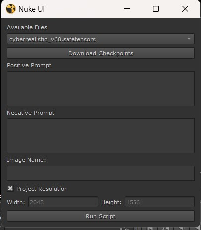

# ComfiUI-Nuke-Integration
# Video-Link
https://www.linkedin.com/posts/gunda-pratap_ai-vfx-compositing-activity-7240871338167390208-3SkN?utm_source=share&utm_medium=member_desktop&rcm=ACoAABOSQCsBCEJyn-YU9zw7k26TQIRfPhs248A
# ComfiUI-Nuke-Integration
Creates Ui and runs to connect with ComfyUI inside nuke to generate images.

- **UI of ComfyUi-Nuke**


## How It Works?
It opens a Ui like above example whre we can select checkpoint and give positive negative prompts and run the code.
It will connect to ComfyUi in the background and generate the image with given settings.

## How to Use?

1. Clone this repo:
    ```bash
    git clone https://github.com/pratap-gunda/ComfiUI-Nuke-Integration.git
    ```
2. Get the dependencies:
    ```bash
    pip install -r requirements.txt
    ```
3. Copy comfiui code to .nuke:
   download and paste 'comfy_nuke_prompt_main.py' to your .nuke folder.

4. Copy menu.py code from this repo to your menu.py in .nuke folder.
   
4. To launch comfy_nuke_prompt:   
    You will see a menu called comfy_tools in nuke inside menu hit comfy_nuke_prompt
   
6. Give prompts and set settings.
   Select checkpoint Give positive negative(optional) prompts and run.
    
